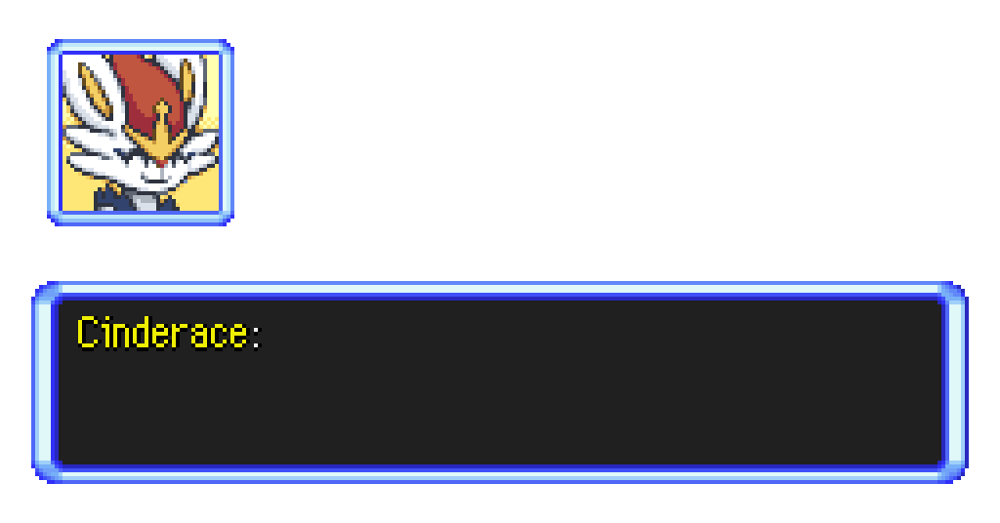

# PMD-Text-Generator
An experimental application which renders a dialogue box similar to that seen in the early Pokémon Mystery Dungeon games.

## Previews

## Notes
The project was originally meant for creating image sequences simulating the style of Pokémon Mystery Dungeon. As such the program doesn't do much outside of displaying hard-coded text. This isn't meant for any real-world use and is mostly a personal exercise.

## Usage
If you still want to build the project you will need a copy of [SFML 2.6.1](https://www.sfml-dev.org/download/sfml/2.6.1/) and [Pugixml-1.14](https://github.com/zeux/pugixml/releases/download/v1.14/pugixml-1.14.zip) extracted in the same folder as the project folder. SFML requires DLLs to be place in the build folder alongside the executable. Instructions on how to do this can be found on the [SFML setup](https://www.sfml-dev.org/tutorials/2.6/start-vc.php) page.

## Credits
Font and interface uses sprites from Pokémon Mystery Dungeon: Explorers of Sky by Nintendo and Spike Chunsoft.
Character portraits were taken from the [PMD Sprite Repository](https://sprites.pmdcollab.org/). Characters belong to The Pokémon Company.
